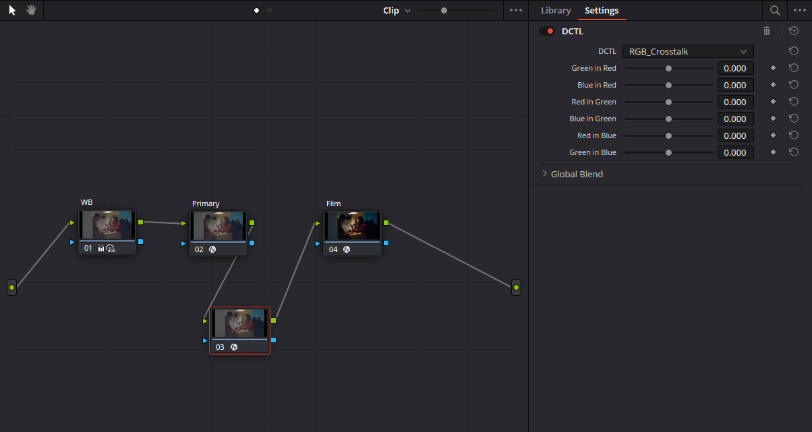

# RGB Crosstalk

A DCTL plugin created for DaVinci Resolve to precisely control the mixing ratios between RGB channels.

## Features

- Allows precise adjustment of each input channel's contribution to each output channel
- Automatically ensures the sum of mixing coefficients for each output channel equals 1, maintaining overall brightness
- Provides intuitive slider UI controls with support for negative parameter values
- Similar to DaVinci Resolve's native RGB mixer, but with more precise control

## Parameter Description

The plugin provides 6 slider parameters, each ranging from -1.0 to 1.0, controlling:

- **Green in Red**: Adjusts the contribution ratio of the green channel to the red output
- **Blue in Red**: Adjusts the contribution ratio of the blue channel to the red output
- **Red in Green**: Adjusts the contribution ratio of the red channel to the green output
- **Blue in Green**: Adjusts the contribution ratio of the blue channel to the green output
- **Red in Blue**: Adjusts the contribution ratio of the red channel to the blue output
- **Green in Blue**: Adjusts the contribution ratio of the green channel to the blue output

The plugin automatically calculates each channel's contribution to its own output, ensuring:
- Red in Red = 1 - (Green in Red) - (Blue in Red)
- Green in Green = 1 - (Red in Green) - (Blue in Green)
- Blue in Blue = 1 - (Red in Blue) - (Green in Blue)

Setting negative values can create more creative effects and color interactions. For example, setting Blue in Red = -0.114 will reduce the contribution of blue in the red channel.

## Installation

1. Copy the `RGB_Crosstalk.dctl` file to DaVinci Resolve's LUT directory:
   - Windows: `C:\ProgramData\Blackmagic Design\DaVinci Resolve\Support\LUT`
   - macOS: `/Library/Application Support/Blackmagic Design/DaVinci Resolve/LUT`

2. Restart DaVinci Resolve (if it's already running)

## Usage

1. In the Color page, open the OpenFX panel
2. Find "ResolveFX Color" > "DCTL" effect
3. Drag the DCTL effect onto a node
4. In the Inspector panel, select "RGB_Crosstalk" from the DCTL List dropdown

## Use Cases

- Creating special color styles and effects
- Fixing color imbalance issues
- Creatively adjusting the color mood of footage
- Implementing more fine-grained cross-color control, including creating color contrast using negative values 